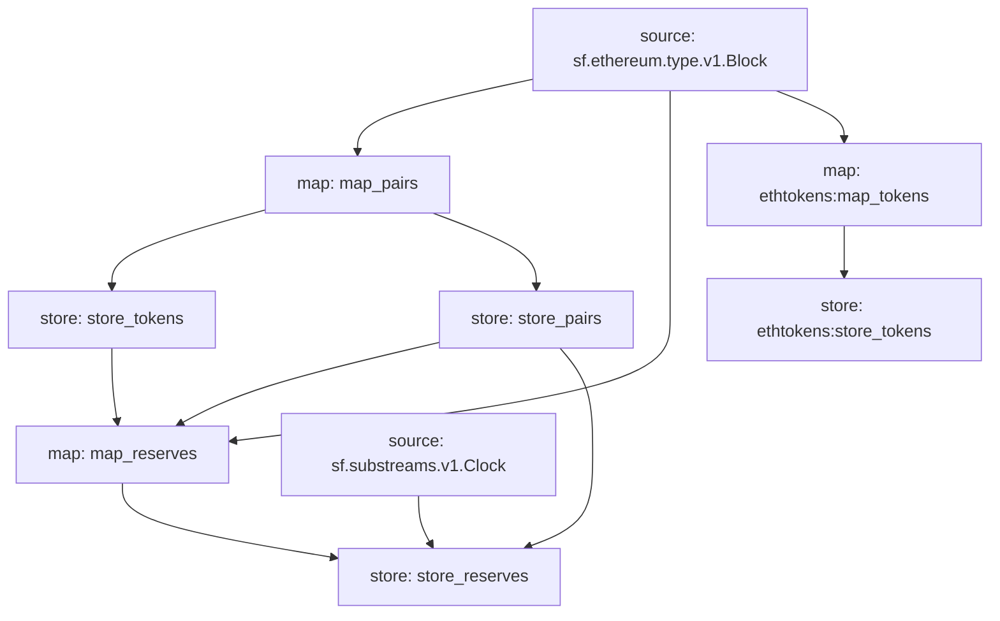

# Uniswap V2 Substreams Example

## Graph

```mermaid
graph TD;
  map_pairs[map: map_pairs]
  sf.ethereum.type.v1.Block[source: sf.ethereum.type.v1.Block] --> map_pairs
  store_tokens[store: store_tokens]
  map_pairs --> store_tokens
  store_pairs[store: store_pairs]
  map_pairs --> store_pairs
  map_reserves[map: map_reserves]
  sf.ethereum.type.v1.Block[source: sf.ethereum.type.v1.Block] --> map_reserves
  store_pairs --> map_reserves
  store_tokens --> map_reserves
  store_reserves[store: store_reserves]
  sf.substreams.v1.Clock[source: sf.substreams.v1.Clock] --> store_reserves
  map_reserves --> store_reserves
  store_pairs --> store_reserves
  ethtokens:map_tokens[map: ethtokens:map_tokens]
  sf.ethereum.type.v1.Block[source: sf.ethereum.type.v1.Block] --> ethtokens:map_tokens
  ethtokens:store_tokens[store: ethtokens:store_tokens]
  ethtokens:map_tokens --> ethtokens:store_tokens
```